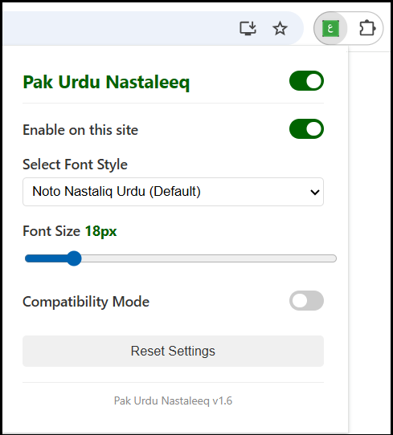
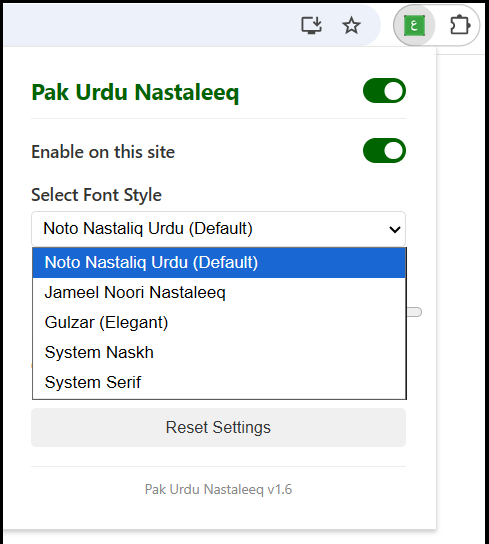
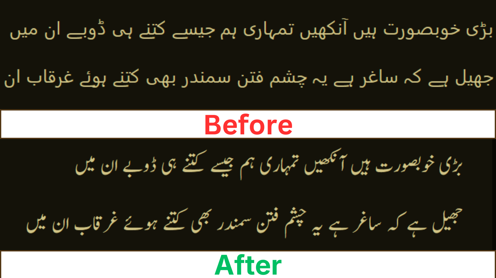

# Pak Urdu Nastaleeq - The Ultimate Urdu Font Chrome Extension 🚀

**Pak Urdu Nastaleeq** is a premium, lightweight, and privacy-focused Google Chrome extension that automatically detects Urdu text on any webpage and renders it in the beautiful, classical **Nastaleeq script**. 

Experience the web in your language as it was meant to be read. Say goodbye to the thin, disjointed default Arabic fonts and enjoy a thick, calligraphic rendered script that feels natural and professional.

---

## 📸 Preview & Screenshots

### Classic Nastaleeq on BBC Urdu

### Modern Interface & Customization
| Popup Interface | Font Selection |
| :---: | :---: |
|  |  |

### Before vs After Comparison

---
## 🆙 Updating to v1.9.1 (Important)

If you are updating from an older version in **Developer Mode**:
1.  **Remove Old Version**: Go to `chrome://extensions/` and click **Remove** on the old "Pak Urdu Nastaleeq".
2.  **Delete Folder**: Delete the old extension folder from your computer to ensure a clean slate.
3.  **Install New**: Download and extract the latest v1.9.1 zip, then "Load Unpacked" pointing to the new folder.
*This ensures all new "Keyboard Protection" features work correctly without caching issues.*
---

## 🌟 Why Pak Urdu Nastaleeq?

If you frequently browse Urdu news sites like **BBC Urdu**, **Dawn News**, or spend time on **Social Media (Facebook, Twitter)**, you know that default browser fonts can be modern, thin, and flat, making long-form reading difficult. 

**Pak Urdu Nastaleeq** is engineered to solve this by providing:
- **Optical Clarity**: Thick strokes and proper ligature nesting.
- **Superior Rendering**: Optimized for high-resolution displays through the Noto Nastaliq and Jameel Noori engines.
- **Universal Support**: Works seamlessly on all dynamic websites using modern JavaScript injection.

### 🚀 Key Features:
- **Surgical Detection**: Automatically identifies Urdu segments while leaving English text 100% untouched. No more layout shifts!
- **5 Premium Fonts**: Choose between *Jameel Noori Nastaleeq (Default)*, *Noto Nastaliq Urdu*, *Gulzar*, and integrated system fonts.
- **Auto-Inherit Mode (v1.9.1)**: Intelligently respects the native sizing of news sites (like Jang, BBC) to prevent layout breakage, while giving you full override control.
- **Universal Keyboard Protection**: Type freely! The extension now automatically detects and protects virtual keyboards and input fields from interference.
- **Dynamic Font Size**: Instantly scale Urdu text from **12px to 60px** with a real-time slider.
- **Per-Site Settings**: Enable or disable the extension specifically for the website you are currently visiting.
- **Deep Sleep Mode**: Zero performance impact. The extension stays dormant until it detects Urdu text on the page.
- **Privacy First**: Everything happens on your machine. No data collection, no tracking, and zero external API calls.

---

## 🔍 Optimized for Your Needs

This extension is highly optimized for users looking for:
- **Best Urdu font for Chrome**
- **Jameel Noori Nastaleeq Chrome Extension**
- **Noto Nastaliq Urdu for web browser**
- **How to fix Urdu text rendering in Windows/Mac/Linux**
- **Download Urdu Nastaleeq font for Google Chrome**
- **Urdu script reader for social media**

---

## 🛠️ How to Install (Step-by-Step)

Since this is an open-source project, you can install it via **Developer Mode** in seconds:

1. **Download**: Click the green `Code` button and select **Download ZIP**.
2. **Extract**: Unzip the file to a folder on your computer (e.g., `Documents/pak-urdu-nastaleeq`).
3. **Open Extensions**: Go to `chrome://extensions/` in your browser.
4. **Developer Mode**: Toggle the switch in the top-right corner to **ON**.
5. **Load Unpacked**: Click the **Load unpacked** button and select the folder you just extracted.
6. **Pin it**: Find the 'Ain' (ع) icon in your extensions list and pin it for quick access!

---

## 📖 How to Use
1. Click the **Pak Urdu Nastaleeq** icon in your toolbar.
2. Use the **Global Toggle** to turn it on/off everywhere.
3. Select your favorite **Font Style** from the dropdown.
4. Use the **Font Size** slider to find your perfect reading zoom.
5. Use **Compatibility Mode** if a specific website's layout appears slightly broken.

---

## 🤝 Contributing & Support
Contributions are welcome! If you have a font suggestion or want to improve the detection algorithm, feel free to fork the repository and submit a pull request.

**Official Repository**: [https://github.com/azibyaqoob/urdu-nastaleeq-extension-chrome](https://github.com/azibyaqoob/urdu-nastaleeq-extension-chrome)

**Chrome Web Store**: [https://chromewebstore.google.com/detail/pak-urdu-nastaleeq/gdfckiaimpjllaljifoihoilhaekmihl](https://chromewebstore.google.com/detail/pak-urdu-nastaleeq/gdfckiaimpjllaljifoihoilhaekmihl)

## ⚖️ License
Distributed under the **MIT License**. See `LICENSE` for more information.

---
*Made with ❤️ for the Urdu Community. Enhance your reading experience today!*

